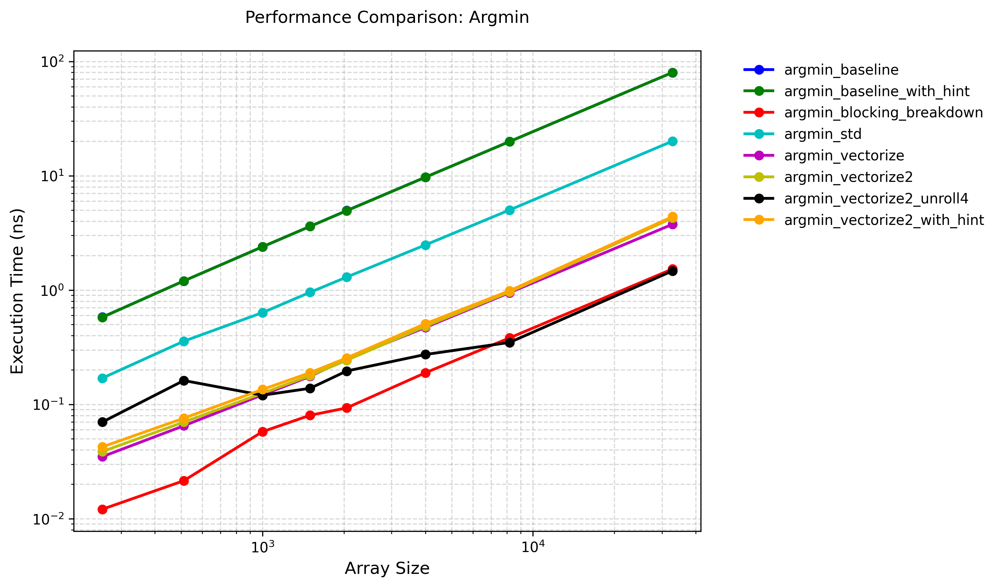

# Argmin Operation

## Optimizations

1. Naive baseline

2. Grouping and using SIMD

We can use avx256 and partition the elements into 8 groups. For each group, we maintain the minimum value and index. And we use SIMD instructions to update the minimum value and index. After that, we do a reduction to get the minimum value and index out of the result of the 8 groups.

3. No grouping and using SIMD

And we can use SIMD instructions in a different way. We maintain a minimum value and a minimum index. And we broadcast the minimum value in a 256-bit register. For every 8 elements, we compare them to the minimum value using SIMD instructions. If nothing is larger than the minimum value, we continue the next iteration. O.w. we iterate through these 8 elements to update the minimum value and the index.

4. Loop unrolling

And we can do loop unrolling to make full use of the hardware resources and CPU pipeline.

5. Breakdown calculating the minimum value and calculating the index into two different parts. Do block processing at a larger block size.

In fact, we don't need to update the minimum index each time we update the minimum value : we can just maintain the block base index where the minimum value resides, and after calculating the minimum value, we search in that block to find the corresponding index. In this way, we can also do block processing at a larger block size.

And in the code, I use some clever trick referenced from [argmin code](https://github.com/sslotin/amh-code/blob/main/argmin/combined.cc). We can use "count trailing zero" instruction in the "find" function to accelerate the index finding process!

## Performance Test

### Test Environment

+ CPU: Intel(R) Xeon(R) Platinum 8358 CPU @ 2.60GHz

+ OS: Rocky Linux 8.9 (Green Obsidian)

+ Compiler Version: G++ 10.5.0

+ Compilation Flags: -O3

+ Execution Command: `taskset -c 0 ./argmin ../config.json`

### Test Results

Test result data is located at [argmin_result.json](./argmin_result.json).

## References

1. [en.algorithmica.org:argmin](https://en.algorithmica.org/hpc/algorithms/argmin/)