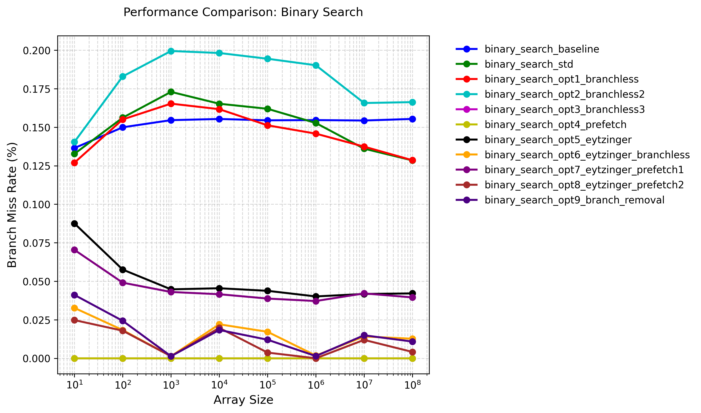
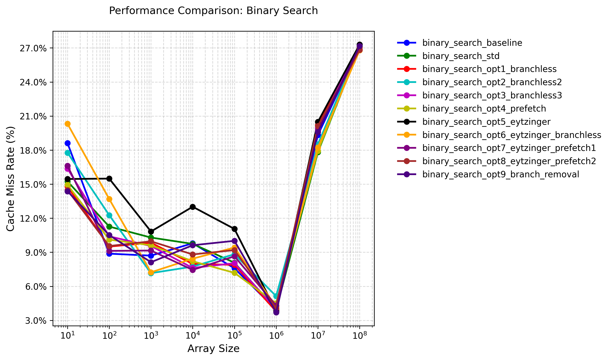
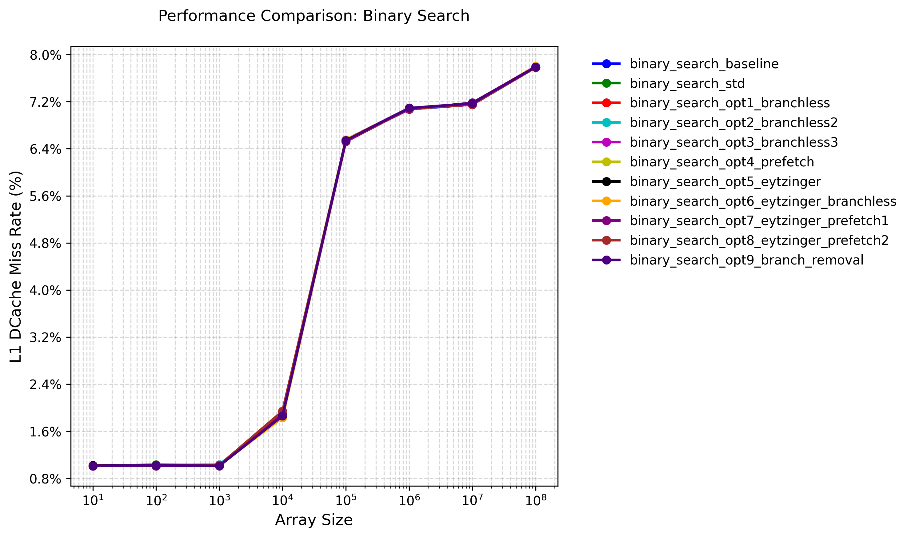

# Binary Search Optimizations

## Optimizations

1. **Branchless Binary Search**:
   - Replaces conditional branches with arithmetic operations
   - Uses pointer arithmetic and multiplication to avoid branch mispredictions
   - Key optimization: `base += (*(base + half - 1) < target) * half`
   - This implementation shows performance boost for small input cases compared to the baseline

2. **Prefetch Optimizations**:
   - Uses `__builtin_prefetch` to prefetch data into cache
   - Prefetches both potential next locations to reduce cache misses
   - Template parameter `PrefetchStrideInElements` allows tuning prefetch distance
   - Shows performance degradation in my test result

3. **Eytzinger Layout**:
   - Transforms the sorted array into a cache-friendly layout
   - Uses a 1-indexed array where children of node k are at 2k and 2k+1
   - Improves spatial locality and reduces cache misses
   - Particularly effective for large arrays

4. **Branch Removal** :
   - Removes the last branch in the search loop
   - Uses a conditional move-like operation for the final comparison
   - Reduces branch mispredictions in the critical path
   - Shows performance degradation in my test result

5. **Memory Alignment**:
   - Uses `AlignedAllocator` for better cache line alignment
   - Template parameter `Aligned` allows switching between aligned and unaligned versions
   - Improves memory access patterns and cache utilization

For detailed analysis, please refer to "Result Analysis" section below.

## Testing

### Test Environment

+ CPU: Intel(R) Xeon(R) Platinum 8358 CPU @ 2.60GHz

+ OS: Rocky Linux 8.9 (Green Obsidian)

+ Compiler Version: G++ 10.5.0

+ Compilation Flags: -O3 -g

+ Execution Command: `taskset -c 0 ./binary_search ../config.json`

### Test Results


As we can see in the graph, the gap between the aligned version and the unaligned version is small and nearly fixed. For simplicity, I plot another graph, with only the aligned version for analysis:


Test result data is located at [binary_search_result.json](./binary_search_result.json).

## Profiling

### Profiling Results

+ Branch Miss Rate



+ Cache Miss Rate



+ l1 DCache Miss Rate



### Result Analysis

Based on the aligned-only test results, we can observe several key findings:


### Assembly Code

The assembly code can be found at [Compiler Explorer](https://godbolt.org/z/zxaxK3cEz).

+ Baseline

A lot of conditional jump!

```asm
; Function prologue - binary_search_baseline implementation
; Inputs:
;   rdi: vector.begin() pointer
;   rsi: vector.end() pointer  
;   edx: target value to search
std::optional<std::reference_wrapper<int const>> binary_search_baseline<true>(...):
        sub     rsi, rdi        ; Calculate vector size in bytes (end - begin)
        mov     r8d, edx        ; Store target value in r8d (preserve across calls)
        sar     rsi, 2          ; Convert byte size to element count (divide by 4)
        sub     esi, 1          ; Adjust size to maximum index (n-1)
        js      .L62            ; If size was 0 (negative index), jump to not-found

        ; Initialize binary search bounds
        xor     edx, edx        ; left = 0 (lower bound)
        
        ; Main binary search loop
.L63:
        lea     eax, [rsi+rdx]  ; mid = (left + right)...
        sar     eax             ; ... / 2 (arithmetic shift for division)
        movsx   rcx, eax        ; Sign-extend mid index to 64-bit
        lea     rcx, [rdi+rcx*4] ; Calculate element address: begin + mid*4
        
        ; Compare current element with target
        cmp     DWORD PTR [rcx], r8d  
        je      .L68            ; Jump if equal (found)
        jge     .L66            ; Jump if array[mid] > target
        
        ; Case: array[mid] < target
        lea     edx, [rax+1]    ; left = mid + 1
        cmp     edx, esi        ; Compare new left with right
        jle     .L63            ; Continue if left <= right
        jmp     .L62            ; Else exit (not found)

        ; Not-found case
.L62:
        mov     BYTE PTR [rsp-16], 0 ; Store false in optional's bool flag
        jmp     .L65            ; Jump to return sequence

        ; Case: array[mid] > target
.L66:
        lea     esi, [rax-1]    ; right = mid - 1
        cmp     esi, edx        ; Compare new right with left
        jge     .L63            ; Continue if right >= left
        jmp     .L62            ; Else exit (not found)

        ; Found case
.L68:
        mov     QWORD PTR [rsp-24], rcx ; Store element address in optional
        mov     BYTE PTR [rsp-16], 1    ; Store true in optional's bool flag
        
        ; Common return sequence
.L65:
        mov     rax, QWORD PTR [rsp-24] ; Load optional's stored pointer
        mov     rdx, QWORD PTR [rsp-16] ; Load optional's bool flag
        ret                     ; Return std::optional{ptr, flag}
```

### STD

## References

1. [Optimizing Binary Search - Sergey Slotin - CppCon 2022](https://www.youtube.com/watch?v=1RIPMQQRBWk)

2. [en.algorithmica.org:binary_search](https://en.algorithmica.org/hpc/data-structures/binary-search/)

3. [qayamd/eytzinger](https://github.com/qayamd/eytzinger)