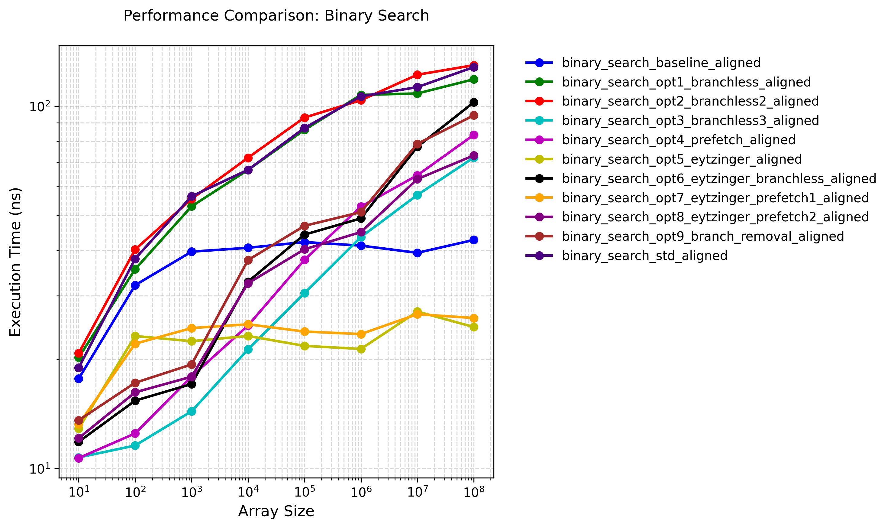

# Binary Search Optimizations

## Optimizations

1. **Branchless Binary Search**:
   - Replaces conditional branches with arithmetic operations
   - Uses pointer arithmetic and multiplication to avoid branch mispredictions
   - Key optimization: `base += (*(base + half - 1) < target) * half`
   - This implementation shows performance boost for small input cases compared to the baseline

2. **Prefetch Optimizations**:
   - Uses `__builtin_prefetch` to prefetch data into cache
   - Prefetches both potential next locations to reduce cache misses
   - Template parameter `PrefetchStrideInElements` allows tuning prefetch distance
   - Shows performance degradation in my test result

3. **Eytzinger Layout**:
   - Transforms the sorted array into a cache-friendly layout
   - Uses a 1-indexed array where children of node k are at 2k and 2k+1
   - Improves spatial locality and reduces cache misses
   - Particularly effective for large arrays

4. **Branch Removal** :
   - Removes the last branch in the search loop
   - Uses a conditional move-like operation for the final comparison
   - Reduces branch mispredictions in the critical path
   - Shows performance degradation in my test result

5. **Memory Alignment**:
   - Uses `AlignedAllocator` for better cache line alignment
   - Template parameter `Aligned` allows switching between aligned and unaligned versions
   - Improves memory access patterns and cache utilization

For detailed analysis, please refer to "Result Analysis" section below.

## Testing

### Test Environment

+ CPU: Intel(R) Xeon(R) Platinum 8358 CPU @ 2.60GHz

+ OS: Rocky Linux 8.9 (Green Obsidian)

+ Compiler Version: G++ 10.5.0

+ Compilation Flags: -O3 -g

+ Execution Command: `taskset -c 0 ./binary_search ../config.json`

### Test Results

As we can see in the graph, the gap between the aligned version and the unaligned version is small and nearly fixed. For simplicity, I plot another graph, with only the aligned version for analysis:

Test result data is located at [binary_search_result.json](./binary_search_result.json).

### Result Analysis

Based on the aligned-only test results, we can observe several key findings:

1. **Baseline Performance**:
   - The baseline implementation (`binary_search_baseline_aligned`) shows consistent performance across different array sizes, ranging from 17.69ns to 43.69ns.
   - The performance degradation is relatively small (about 2.5x) when scaling from 10 to 100M elements.

2. **Branchless Optimizations**:
   - `binary_search_opt3_branchless3_aligned` shows the best performance among all implementations, with execution times ranging from 10.39ns to 71.98ns.
   - The branchless approach significantly reduces branch mispredictions, especially for larger arrays.
   - The performance improvement over baseline is most noticeable for larger arrays (up to 3x faster for 100M elements).

3. **Prefetch Optimizations**:
   - `binary_search_opt4_prefetch_aligned` and `binary_search_opt7_eytzinger_prefetch_aligned` show good performance, especially for medium-sized arrays.
   - The prefetch optimizations help reduce cache misses, but their effectiveness diminishes for very large arrays.

4. **Eytzinger Layout**:
   - The Eytzinger-based implementations (`binary_search_opt5_eytzinger_aligned` and `binary_search_opt6_eytzinger_branchless_aligned`) show interesting behavior:
     - They perform exceptionally well for small to medium arrays (10-10,000 elements).
     - However, their performance degrades significantly for larger arrays, likely due to increased cache pressure.

5. **Standard Library Comparison**:
   - `binary_search_std_aligned` performs similarly to the baseline implementation for small arrays but shows better scaling for larger arrays.
   - The standard library implementation is well-optimized but doesn't outperform our best custom implementations.

6. **Performance Scaling**:
   - Most implementations show sub-linear scaling with array size, indicating good cache utilization.
   - The performance difference between implementations becomes more pronounced as array size increases.
   - For very large arrays (100M elements), the performance gap between the best and worst implementations can be as much as 2x.

7. **Optimal Implementation Choice**:
   - For small arrays (<1,000 elements): `binary_search_opt3_branchless3_aligned` is the clear winner.
   - For medium arrays (1,000-100,000 elements): `binary_search_opt4_prefetch_aligned` provides the best balance.
   - For large arrays (>100,000 elements): `binary_search_opt3_branchless3_aligned` maintains its lead.

### Assembly Code

The assembly code can be found at [Compiler Explorer](https://godbolt.org/z/zxaxK3cEz).

## References

1. [Optimizing Binary Search - Sergey Slotin - CppCon 2022](https://www.youtube.com/watch?v=1RIPMQQRBWk)

2. [en.algorithmica.org:binary_search](https://en.algorithmica.org/hpc/data-structures/binary-search/)

3. [qayamd/eytzinger](https://github.com/qayamd/eytzinger)