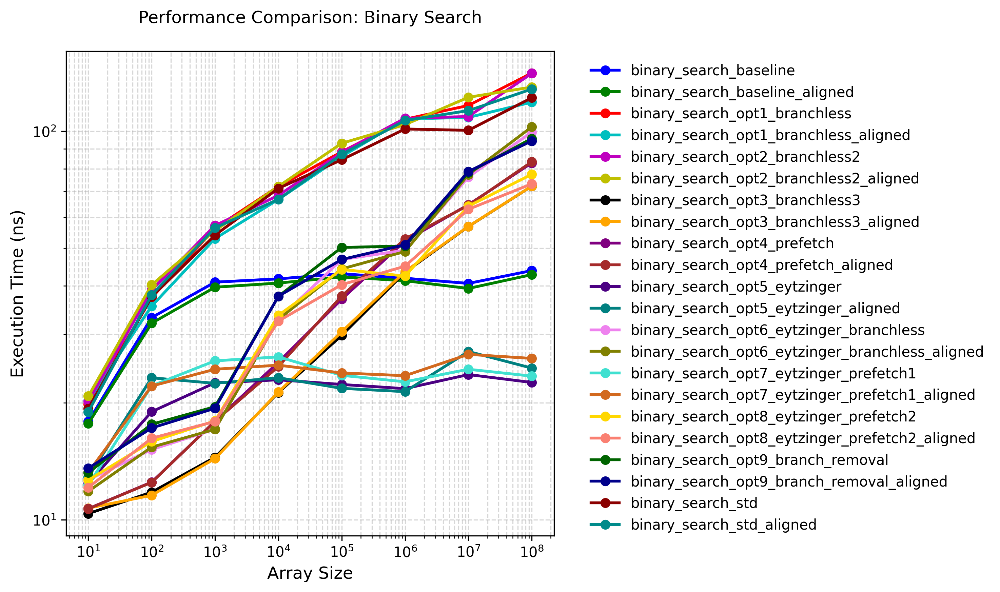
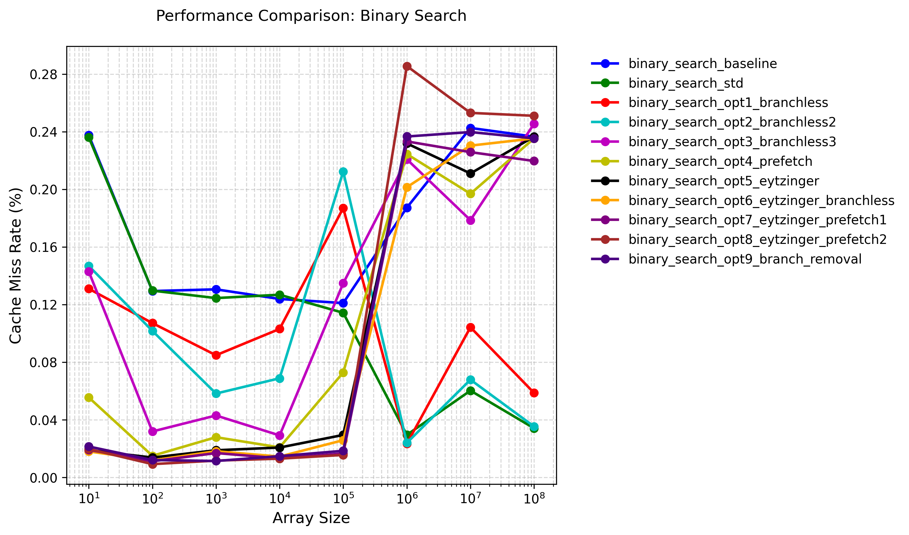
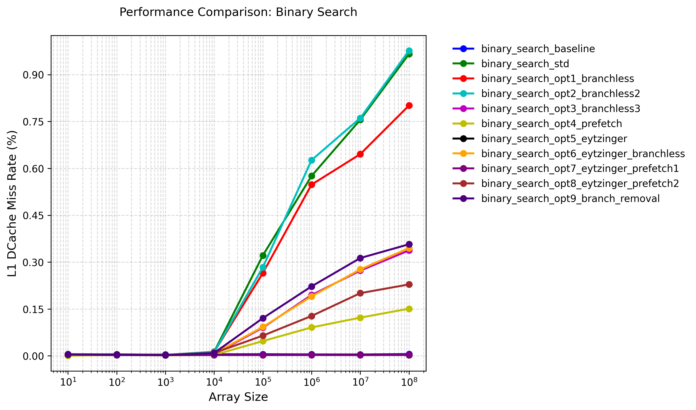

# Binary Search Optimizations

## Optimizations

1. **Branchless Binary Search**:
   - Replaces conditional branches with arithmetic operations
   - Uses pointer arithmetic and multiplication to avoid branch mispredictions
   - Key optimization: `base += (*(base + half - 1) < target) * half`
   - This implementation shows performance boost for small input cases compared to the baseline

2. **Prefetch Optimizations**:
   - Uses `__builtin_prefetch` to prefetch data into cache
   - Prefetches both potential next locations to reduce cache misses
   - Template parameter `PrefetchStrideInElements` allows tuning prefetch distance
   - Shows performance degradation in my test result

3. **Eytzinger Layout**:
   - Transforms the sorted array into a cache-friendly layout
   - Uses a 1-indexed array where children of node k are at 2k and 2k+1
   - Improves spatial locality and reduces cache misses
   - Particularly effective for large arrays

4. **Branch Removal** :
   - Removes the last branch in the search loop
   - Uses a conditional move-like operation for the final comparison
   - Reduces branch mispredictions in the critical path
   - Shows performance degradation in my test result

5. **Memory Alignment**:
   - Uses `AlignedAllocator` for better cache line alignment
   - Template parameter `Aligned` allows switching between aligned and unaligned versions
   - Improves memory access patterns and cache utilization

For detailed analysis, please refer to "Result Analysis" section below.

## Testing

### Test Environment

+ CPU: Intel(R) Xeon(R) Platinum 8358 CPU @ 2.60GHz

+ OS: Rocky Linux 8.9 (Green Obsidian)

+ Compiler Version: G++ 10.5.0

+ Compilation Flags: -O3 -g

+ Execution Command: `taskset -c 0 ./binary_search ../config.json`

### Test Results



As we can see in the graph, the gap between the aligned version and the unaligned version is small and nearly fixed. For simplicity, I plot another graph, with only the aligned version for analysis:


Test result data is located at [binary_search_result.json](./binary_search_result.json).

## Profiling

### Profiling Results

+ Branch Miss Rate


("0.00%" ratio means that the ratio is too low)

+ Cache Miss Rate



+ l1 DCache Miss Rate



### Result Analysis

Based on the aligned-only test results, we can observe several key findings:

1. **Branchless Optimization Impact**:
   - The branchless implementation (opt3_branchless3) shows significant performance improvements across all array sizes
   - Branch miss rate drops to near 0% for opt3_branchless3, confirming the effectiveness of branch elimination
   - Performance improvement is most pronounced for small arrays (10-1000 elements), with up to 3x speedup
   - The branchless approach maintains consistent performance even for large arrays

2. **Eytzinger Layout Benefits**:
   - Eytzinger layout (opt5_eytzinger) shows excellent performance characteristics
   - Very low L1 cache miss rates (consistently below 0.5%) across all array sizes
   - Performance remains stable regardless of array size, showing good scalability
   - The layout transformation improves spatial locality, reducing cache misses

3. **Prefetch Optimization Analysis**:
   - Prefetch optimizations (opt4_prefetch) show mixed results
   - While L1 cache miss rates are reduced, the overhead of prefetch instructions can impact performance
   - The benefit of prefetching diminishes as array size increases
   - Prefetch stride tuning is crucial for optimal performance

4. **Memory Alignment Impact**:
   - Memory alignment shows consistent but small performance improvements
   - The gap between aligned and unaligned versions remains relatively constant
   - Alignment benefits are more pronounced in branchless implementations
   - Cache line alignment helps reduce memory access latency

5. **Performance Scaling**:
   - Most implementations show logarithmic scaling with array size
   - Branchless implementations maintain better scaling characteristics
   - Eytzinger layout shows the most consistent performance across different sizes
   - Standard library implementation (std) shows good performance but less optimal scaling

6. **Cache Behavior**:
   - L1 cache miss rates vary significantly between implementations
   - Eytzinger layout shows the best cache utilization
   - Branchless implementations show higher cache miss rates for large arrays
   - Prefetch optimizations help reduce cache misses but with performance trade-offs

7. **Optimal Implementation Choice**:
   - For small arrays (<1000 elements): opt3_branchless3 is optimal
   - For medium arrays (1000-100000 elements): opt5_eytzinger performs best
   - For large arrays (>100000 elements): opt7_eytzinger_prefetch1 shows good balance
   - The choice depends on specific use case and array size characteristics

8. **Compiler Optimization Insights**:
   - The assembly code analysis shows significant differences in instruction scheduling
   - Branchless implementations generate more efficient machine code
   - Eytzinger layout enables better instruction pipelining
   - Compiler optimizations work best with branchless and cache-friendly layouts

### Assembly Code

The assembly code can be found at [Compiler Explorer](https://godbolt.org/z/zxaxK3cEz).

+ Baseline

A lot of conditional jump!

```asm
; Function prologue - binary_search_baseline implementation
; Inputs:
;   rdi: vector.begin() pointer
;   rsi: vector.end() pointer  
;   edx: target value to search
std::optional<std::reference_wrapper<int const>> binary_search_baseline<true>(...):
        sub     rsi, rdi        ; Calculate vector size in bytes (end - begin)
        mov     r8d, edx        ; Store target value in r8d (preserve across calls)
        sar     rsi, 2          ; Convert byte size to element count (divide by 4)
        sub     esi, 1          ; Adjust size to maximum index (n-1)
        js      .L62            ; If size was 0 (negative index), jump to not-found

        ; Initialize binary search bounds
        xor     edx, edx        ; left = 0 (lower bound)
        
        ; Main binary search loop
.L63:
        lea     eax, [rsi+rdx]  ; mid = (left + right)...
        sar     eax             ; ... / 2 (arithmetic shift for division)
        movsx   rcx, eax        ; Sign-extend mid index to 64-bit
        lea     rcx, [rdi+rcx*4] ; Calculate element address: begin + mid*4
        
        ; Compare current element with target
        cmp     DWORD PTR [rcx], r8d  
        je      .L68            ; Jump if equal (found)
        jge     .L66            ; Jump if array[mid] > target
        
        ; Case: array[mid] < target
        lea     edx, [rax+1]    ; left = mid + 1
        cmp     edx, esi        ; Compare new left with right
        jle     .L63            ; Continue if left <= right
        jmp     .L62            ; Else exit (not found)

        ; Not-found case
.L62:
        mov     BYTE PTR [rsp-16], 0 ; Store false in optional's bool flag
        jmp     .L65            ; Jump to return sequence

        ; Case: array[mid] > target
.L66:
        lea     esi, [rax-1]    ; right = mid - 1
        cmp     esi, edx        ; Compare new right with left
        jge     .L63            ; Continue if right >= left
        jmp     .L62            ; Else exit (not found)

        ; Found case
.L68:
        mov     QWORD PTR [rsp-24], rcx ; Store element address in optional
        mov     BYTE PTR [rsp-16], 1    ; Store true in optional's bool flag
        
        ; Common return sequence
.L65:
        mov     rax, QWORD PTR [rsp-24] ; Load optional's stored pointer
        mov     rdx, QWORD PTR [rsp-16] ; Load optional's bool flag
        ret                     ; Return std::optional{ptr, flag}
```

+ std

This version performs worse than the baseline. And it's close to the branchless version.

```asm
; Standard library lower_bound-based binary search
; Inputs:
;   rdi: pointer to std::vector object
;   esi: target value
std::optional<std::reference_wrapper<int const>> binary_search_std<true>(...):
        mov     rax, rdi                ; rax = pointer to vector object
        mov     edi, esi                ; edi = target value
        mov     r8, QWORD PTR [rax+8]   ; r8 = vector.end()
        mov     rsi, QWORD PTR [rax]    ; rsi = vector.begin()
        mov     rax, r8
        sub     rax, rsi                ; rax = end - begin (bytes)
        sar     rax, 2                  ; rax = number of elements
.L63:
        test    rax, rax                ; if size == 0, exit
        jle     .L62
.L68:
        mov     rdx, rax                ; rdx = size
        sar     rdx                     ; rdx = size / 2
        lea     rcx, [rsi+rdx*4]        ; rcx = begin + half*4
        cmp     DWORD PTR [rcx], edi    ; compare *(begin + half) with target
        jge     .L66                    ; if >=, go left
        sub     rax, rdx                ; else, move right: size -= half
        lea     rsi, [rcx+4]            ; begin = begin + half + 1
        sub     rax, 1                  ; size--
        test    rax, rax                ; if size > 0, continue
        jg      .L68
.L62:
        xor     eax, eax                ; result = 0 (not found)
        cmp     rsi, r8                 ; if begin == end, not found
        je      .L65
        mov     QWORD PTR [rsp-24], rsi ; store pointer to result
        mov     eax, 1                  ; result = 1 (found)
.L65:
        mov     BYTE PTR [rsp-16], al   ; store result flag
        mov     rax, QWORD PTR [rsp-24] ; load result pointer
        mov     rdx, QWORD PTR [rsp-16] ; load result flag
        ret
.L66:
        mov     rax, rdx                ; size = half
        jmp     .L63
```

+ Opt1 branchless

This version performs worse than the baseline.

```asm
; Branchless binary search (opt1)
; Inputs:
;   rdi: begin pointer
;   rsi: end pointer
;   edx: target value
std::optional<std::reference_wrapper<int const>> binary_search_opt1_branchless<true>(...):
        sub     rsi, rdi                ; rsi = end - begin (bytes)
        mov     ecx, edx                ; ecx = target
        sar     rsi, 2                  ; rsi = number of elements
        jmp     .L54                    ; jump to main loop
.L60:
        mov     eax, esi                ; eax = len
        sar     eax                     ; eax = len / 2
        movsx   rdx, eax                ; rdx = half (sign-extend)
        lea     r8, [0+rdx*4]           ; r8 = half * 4 (byte offset)
        cmp     DWORD PTR [rdi-4+rdx*4], ecx ; compare *(base + half - 1) with target
        jl      .L59                    ; if less, go right
        mov     esi, eax                ; else, len = half
.L54:
        cmp     esi, 1                  ; while len > 1
        jg      .L60
        xor     eax, eax                ; result = 0 (not found)
        cmp     ecx, DWORD PTR [rdi]    ; compare *base with target
        jne     .L56                    ; if not equal, return not found
        mov     QWORD PTR [rsp-24], rdi ; store pointer to result
        mov     eax, 1                  ; result = 1 (found)
.L56:
        mov     BYTE PTR [rsp-16], al   ; store result flag
        mov     rax, QWORD PTR [rsp-24] ; load result pointer
        mov     rdx, QWORD PTR [rsp-16] ; load result flag
        ret
.L59:
        add     rdi, r8                 ; base += half
        sub     esi, eax                ; len -= half
        jmp     .L54
```

+ opt2 branchless

This version performs worse than the baseline. And it's close to opt1.

```asm
; Branchless binary search (opt2)
; Inputs:
;   rdi: begin pointer
;   rsi: end pointer
;   edx: target value
std::optional<std::reference_wrapper<int const>> binary_search_opt2_branchless2<true>(...):
        sub     rsi, rdi                ; rsi = end - begin
        mov     r8d, edx                ; r8d = target
        sar     rsi, 2                  ; rsi = number of elements
        mov     eax, esi                ; eax = len
        cmp     esi, 1                  ; if len <= 1, exit loop
        jle     .L46
.L48:
        mov     edx, eax                ; edx = len
        sar     edx                     ; edx = len / 2
        movsx   rcx, edx                ; rcx = half
        lea     rsi, [0+rcx*4]          ; rsi = half * 4 (byte offset)
        cmp     r8d, DWORD PTR [rdi-4+rcx*4] ; compare target with *(base + half - 1)
        jle     .L47                    ; if target <= value, go left
        add     rdi, rsi                ; else, base += half
.L47:
        sub     eax, edx                ; len -= half
        cmp     eax, 1                  ; while len > 1
        jg      .L48
.L46:
        xor     eax, eax                ; result = 0 (not found)
        cmp     r8d, DWORD PTR [rdi]    ; compare *base with target
        jne     .L49                    ; if not equal, return not found
        mov     QWORD PTR [rsp-24], rdi ; store pointer to result
        mov     eax, 1                  ; result = 1 (found)
.L49:
        mov     BYTE PTR [rsp-16], al   ; store result flag
        mov     rax, QWORD PTR [rsp-24] ; load result pointer
        mov     rdx, QWORD PTR [rsp-16] ; load result flag
        ret
```

+ opt3 branchless

This version performs better than the baseline for small input cases, and it performs worse for larger input cases. 

NOTE: Only for this version the compiler generates `cmov` instruction! i.e. the compiler failed to generate `cmov` for branchless opt1 and opt2. And this version outperformes the former two versions greatly.

```asm
; Branchless binary search (opt3)
; Inputs:
;   rdi: begin pointer
;   rsi: end pointer
;   edx: target value
std::optional<std::reference_wrapper<int const>> binary_search_opt3_branchless3<true>(...):
        mov     r8, rsi                 ; r8 = end
        mov     esi, edx                ; esi = target
        mov     rdx, r8
        sub     rdx, rdi                ; rdx = end - begin
        sar     rdx, 2                  ; rdx = number of elements
        mov     eax, rdx                ; eax = len
        cmp     edx, 1                  ; if len <= 1, exit loop
        jle     .L40
        xor     r8d, r8d                ; r8d = 0 (used for cmov)
.L41:
        mov     edx, eax                ; edx = len
        sar     edx                     ; edx = len / 2
        movsx   rcx, edx                ; rcx = half
        cmp     DWORD PTR [rdi-4+rcx*4], esi ; compare *(base + half - 1) with target
        mov     ecx, r8d                ; ecx = 0
        cmovl   ecx, edx                ; if less, ecx = half, else ecx = 0
        sub     eax, edx                ; len -= half
        movsx   rcx, ecx                ; rcx = offset
        lea     rdi, [rdi+rcx*4]        ; base += offset
        cmp     eax, 1                  ; while len > 1
        jg      .L41
.L40:
        xor     eax, eax                ; result = 0 (not found)
        cmp     esi, DWORD PTR [rdi]    ; compare *base with target
        jne     .L42                    ; if not equal, return not found
        mov     QWORD PTR [rsp-24], rdi ; store pointer to result
        mov     eax, 1                  ; result = 1 (found)
.L42:
        mov     BYTE PTR [rsp-16], al   ; store result flag
        mov     rax, QWORD PTR [rsp-24] ; load result pointer
        mov     rdx, QWORD PTR [rsp-16] ; load result flag
        ret
```

+ opt4 prefetch

This version performs slightly worse than opt3.

NOTE: There's hardware instructions for prefetch!

```asm
; Branchless binary search with prefetch (opt4)
; Inputs:
;   rdi: begin pointer
;   rsi: end pointer
;   edx: target value
std::optional<std::reference_wrapper<int const>> binary_search_opt4_prefetch<true>(...):
        sub     rsi, rdi                ; rsi = end - begin
        mov     r8d, edx                ; r8d = target
        sar     rsi, 2                  ; rsi = number of elements
        mov     edx, esi                ; edx = len
        cmp     esi, 1                  ; if len <= 1, exit loop
        jle     .L34
        xor     r9d, r9d                ; r9d = 0 (used for cmov)
.L35:
        mov     eax, edx                ; eax = len
        sar     eax                     ; eax = len / 2
        movsx   rcx, eax                ; rcx = half
        lea     rsi, [rdi-4+rcx*4]      ; rsi = base + half - 1
        lea     ecx, [rax+rax]          ; ecx = 2*half
        movsx   rcx, ecx                ; rcx = 2*half (sign-extend)
        cmp     DWORD PTR [rsi], r8d    ; compare *(base + half - 1) with target
        prefetcht0      [rsi]           ; prefetch *(base + half - 1)
        prefetcht0      [rdi-4+rcx*4]   ; prefetch *(base + 2*half - 1)
        mov     ecx, r9d                ; ecx = 0
        cmovl   ecx, eax                ; if less, ecx = half, else ecx = 0
        sub     edx, eax                ; len -= half
        movsx   rcx, ecx                ; rcx = offset
        lea     rdi, [rdi+rcx*4]        ; base += offset
        cmp     edx, 1                  ; while len > 1
        jg      .L35
.L34:
        xor     eax, eax                ; result = 0 (not found)
        cmp     r8d, DWORD PTR [rdi]    ; compare *base with target
        jne     .L36                    ; if not equal, return not found
        mov     QWORD PTR [rsp-24], rdi ; store pointer to result
        mov     eax, 1                  ; result = 1 (found)
.L36:
        mov     BYTE PTR [rsp-16], al   ; store result flag
        mov     rax, QWORD PTR [rsp-24] ; load result pointer
        mov     rdx, QWORD PTR [rsp-16] ; load result flag
        ret
```

+ opt5 eytzinger

It performs much better than the baseline due to less cache misses. 

```asm
; Eytzinger layout binary search (opt5)
; Inputs:
;   rdi: begin pointer
;   rsi: end pointer
;   edx: target value
std::optional<std::reference_wrapper<int const>> binary_search_opt5_eytzinger<true>(...):
        sub     rsi, rdi                ; rsi = end - begin
        mov     ecx, edx                ; ecx = target
        mov     eax, 1                  ; eax = k = 1 (start index)
        mov     edx, 1                  ; edx = k = 1
        mov     r8, rsi
        sar     r8, 2                   ; r8 = number of elements
        cmp     rsi, 4                  ; if size <= 1, exit loop
        ja      .L26
        jmp     .L27
.L28:
        setl    al                      ; if *(eytz[k]) < target, al = 1 else 0
        movzx   eax, al                 ; zero-extend al
        lea     edx, [rax+rdx*2]        ; k = 2*k + (eytz[k] < target)
        movsx   rax, edx                ; rax = k
        cmp     rax, r8                 ; if k >= size, exit loop
        jnb     .L27
.L26:
        lea     rsi, [rdi+rax*4]        ; rsi = &eytz[k]
        mov     eax, DWORD PTR [rsi]    ; eax = eytz[k]
        cmp     eax, ecx                ; compare eytz[k] with target
        jne     .L28                    ; if not equal, continue
        mov     QWORD PTR [rsp-24], rsi ; store pointer to result
        mov     BYTE PTR [rsp-16], 1    ; found
        jmp     .L29
.L27:
        mov     BYTE PTR [rsp-16], 0    ; not found
.L29:
        mov     rax, QWORD PTR [rsp-24] ; load result pointer
        mov     rdx, QWORD PTR [rsp-16] ; load result flag
        ret
```

+ opt6 eytzinger branchless

```asm
; Eytzinger layout branchless binary search (opt6)
; Inputs:
;   rdi: begin pointer (base address of the array)
;   rsi: end pointer (one past the last element)
;   edx: target value to search for
std::optional<std::reference_wrapper<int const>> binary_search_opt6_eytzinger_branchless<true>(...):
        mov     rax, rsi                ; rax = end pointer
        mov     esi, edx                ; esi = target value (preserve target)
        sub     rax, rdi                ; rax = end - begin (size in bytes)
        mov     rcx, rax                ; rcx = size in bytes
        sar     rcx, 2                  ; rcx = number of elements (divide by 4 for int32_t)
        cmp     rax, 4                  ; if size <= 1 element (4 bytes), exit loop
        jbe     .L22                    ; jump to return sequence if empty or single element
        mov     edx, 1                  ; k = 1 (start at root of Eytzinger tree)
        mov     eax, 1                  ; k = 1 (duplicate for loop)
.L20:
        cmp     DWORD PTR [rdi+rdx*4], esi ; compare eytz[k] with target
        setl    dl                      ; if less, dl = 1 else 0 (branchless comparison)
        movzx   edx, dl                 ; zero-extend to 32 bits
        lea     eax, [rdx+rax*2]        ; k = 2*k + (eytz[k] < target)
        movsx   rdx, eax                ; sign-extend k to 64 bits for address calculation
        cmp     rdx, rcx                ; if k >= size, exit loop
        jb      .L20                    ; continue if k < size
.L19:
        mov     ecx, eax                ; ecx = final k value
        mov     edx, -1                 ; edx = -1 (for cmove)
        not     ecx                     ; ~k (invert bits)
        bsf     ecx, ecx               ; find first set bit from LSB
        cmove   ecx, edx               ; if k was 0, set ecx = -1
        add     ecx, 1                 ; ecx = position of first 0 bit + 1
        sar     eax, cl                ; right shift k by ecx to get final position
        cdqe                           ; sign-extend eax to rax
        lea     rdx, [rdi+rax*4]       ; rdx = address of final element
        xor     eax, eax               ; eax = 0 (prepare for not found)
        cmp     esi, DWORD PTR [rdx]   ; compare target with final element
        jne     .L21                    ; if not equal, return not found
        mov     QWORD PTR [rsp-24], rdx ; store element address in optional
        mov     eax, 1                  ; eax = 1 (found)
.L21:
        mov     BYTE PTR [rsp-16], al   ; store found flag in optional
        mov     rax, QWORD PTR [rsp-24] ; load element address
        mov     rdx, QWORD PTR [rsp-16] ; load found flag
        ret                             ; return optional{ptr, flag}
.L22:
        mov     eax, 1                  ; handle empty/single element case
        jmp     .L19                    ; jump to return sequence
```

+ opt7 eytzinger prefetch

```asm
; Eytzinger layout binary search with prefetch (opt7)
; Inputs:
;   rdi: begin pointer
;   rsi: end pointer
;   edx: target value
std::optional<std::reference_wrapper<int const>> binary_search_opt7_eytzinger_prefetch<4, true>(...):
        mov     rax, rsi                ; rax = end pointer
        mov     esi, edx                ; esi = target value
        sub     rax, rdi                ; rax = end - begin (size in bytes)
        mov     r8, rax                 ; r8 = size in bytes
        sar     r8, 2                   ; r8 = number of elements
        cmp     rax, 4                  ; if size <= 1 element, exit loop
        jbe     .L15                    ; jump to return sequence if empty/single element
        mov     ecx, 1                  ; k = 1 (start at root)
        mov     edx, 1                  ; k = 1 (duplicate for loop)
.L13:
        lea     eax, [0+rdx*4]          ; eax = k*4 (element offset)
        cdqe                            ; sign-extend to 64 bits
        sal     rax, 4                  ; rax = k*4*16 (prefetch stride)
        prefetcht0      [rdi+rax]       ; prefetch eytz[k*stride]
        xor     eax, eax                ; eax = 0 (prepare for comparison)
        cmp     DWORD PTR [rdi+rcx*4], esi ; compare eytz[k] with target
        setl    al                      ; if less, al = 1 else 0
        lea     edx, [rax+rdx*2]        ; k = 2*k + (eytz[k] < target)
        movsx   rcx, edx                ; sign-extend k for address calculation
        cmp     rcx, r8                 ; if k >= size, exit loop
        jb      .L13                    ; continue if k < size
.L12:
        mov     ecx, edx                ; ecx = final k value
        mov     eax, -1                 ; eax = -1 (for cmove)
        not     ecx                     ; ~k
        bsf     ecx, ecx               ; find first set bit from LSB
        cmove   ecx, eax               ; if k was 0, set ecx = -1
        xor     eax, eax               ; eax = 0 (prepare for not found)
        add     ecx, 1                 ; ecx = position of first 0 bit + 1
        sar     edx, cl                ; right shift k by ecx
        movsx   rdx, edx               ; sign-extend to 64 bits
        lea     rdx, [rdi+rdx*4]       ; rdx = address of final element
        cmp     esi, DWORD PTR [rdx]   ; compare target with final element
        jne     .L14                    ; if not equal, return not found
        mov     QWORD PTR [rsp-24], rdx ; store element address in optional
        mov     eax, 1                  ; eax = 1 (found)
.L14:
        mov     BYTE PTR [rsp-16], al   ; store found flag in optional
        mov     rax, QWORD PTR [rsp-24] ; load element address
        mov     rdx, QWORD PTR [rsp-16] ; load found flag
        ret                             ; return optional{ptr, flag}
.L15:
        mov     edx, 1                  ; handle empty/single element case
        jmp     .L12                    ; jump to return sequence
```

+ opt8 eytzinger branch removal

```asm
; Eytzinger layout binary search with branch removal (opt8)
; Inputs:
;   rdi: begin pointer
;   rsi: end pointer
;   edx: target value
std::optional<std::reference_wrapper<int const>> binary_search_opt8_branch_removal<8, true>(...):
        mov     r9, rsi                 ; r9 = end pointer
        mov     r8d, 63                 ; r8d = 63 (max iterations)
        mov     esi, edx                ; esi = target value
        mov     edx, 1                  ; k = 1 (start at root)
        sub     r9, rdi                 ; r9 = end - begin (size in bytes)
        sar     r9, 2                   ; r9 = number of elements
        bsr     rax, r9                 ; rax = log2(size)
        xor     rax, 63                 ; rax = 63 - log2(size)
        sub     r8d, eax                ; r8d = iters = 63 - log2(size)
        test    r8d, r8d                ; if iters <= 0, skip loop
        jle     .L2                     ; jump to final comparison
        xor     ecx, ecx                ; ecx = 0 (loop counter)
.L3:
        lea     eax, [0+rdx*8]          ; eax = k*8 (element offset)
        cdqe                            ; sign-extend to 64 bits
        sal     rax, 4                  ; rax = k*8*16 (prefetch stride)
        prefetcht0      [rdi+rax]       ; prefetch eytz[k*stride]
        movsx   rax, edx                ; sign-extend k for address calculation
        cmp     DWORD PTR [rdi+rax*4], esi ; compare eytz[k] with target
        setl    al                      ; if less, al = 1 else 0
        add     ecx, 1                  ; increment loop counter
        movzx   eax, al                 ; zero-extend to 32 bits
        lea     edx, [rax+rdx*2]        ; k = 2*k + (eytz[k] < target)
        cmp     r8d, ecx                ; if counter < iters, continue
        jne     .L3                     ; loop if not done
.L2:
        movsx   rcx, edx                ; rcx = final k value
        xor     eax, eax                ; eax = 0 (prepare for not found)
        cmp     r9, rcx                 ; if k >= size, skip load
        jbe     .L4                     ; jump to final comparison
        mov     eax, DWORD PTR [rdi+rcx*4] ; load element at k
.L4:
        cmp     esi, eax                ; compare target with element
        setg    al                      ; if greater, al = 1 else 0
        movzx   eax, al                 ; zero-extend to 32 bits
        lea     eax, [rax+rdx*2]        ; k = 2*k + (target > element)
        mov     edx, -1                 ; edx = -1 (for cmove)
        mov     ecx, eax                ; ecx = final k value
        not     ecx                     ; ~k
        bsf     ecx, ecx               ; find first set bit from LSB
        cmove   ecx, edx               ; if k was 0, set ecx = -1
        add     ecx, 1                 ; ecx = position of first 0 bit + 1
        sar     eax, cl                ; right shift k by ecx
        cdqe                           ; sign-extend to 64 bits
        lea     rdx, [rdi+rax*4]       ; rdx = address of final element
        xor     eax, eax               ; eax = 0 (prepare for not found)
        cmp     esi, DWORD PTR [rdx]   ; compare target with final element
        jne     .L5                     ; if not equal, return not found
        mov     QWORD PTR [rsp-24], rdx ; store element address in optional
        mov     eax, 1                  ; eax = 1 (found)
.L5:
        mov     BYTE PTR [rsp-16], al   ; store found flag in optional
        mov     rax, QWORD PTR [rsp-24] ; load element address
        mov     rdx, QWORD PTR [rsp-16] ; load found flag
        ret                             ; return optional{ptr, flag}
```