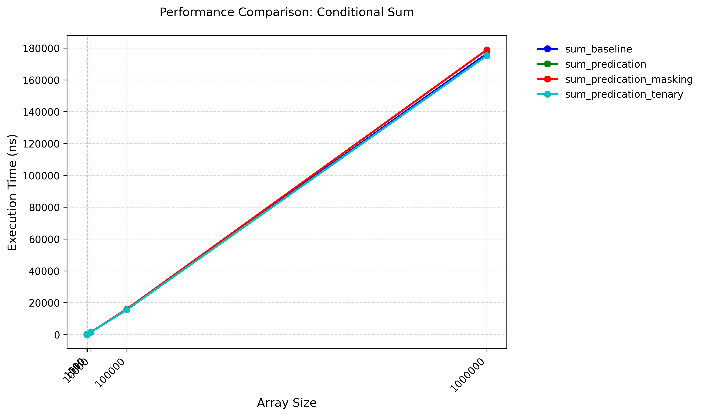

# ConditionalArray Sum Experiments

For a simple function that "calculates the sum of elements in an array not exceeding UpperBound," I have implemented the following four versions:

1. Naive Version

```cpp
template <int32_t UpperBound>
int32_t sum_baseline(std::vector<int32_t> & elements) {
    int32_t sum = 0;
    for(auto e : elements) {
        if(e < UpperBound) {
            sum += e;
        }
    }
    return sum;
}
```

2. Using Predication

```cpp
template <int32_t UpperBound>
int32_t sum_predication(std::vector<int32_t> & elements) {
    int32_t sum = 0;
    for(auto e : elements) {
        sum += (e < UpperBound) * e;
    }
    return sum;
}
```

3. Using Predication and Tenary Operator

```cpp
template <int32_t UpperBound>
int32_t sum_predication_tenary(std::vector<int32_t> & elements) {
    int32_t sum = 0;
    for(auto e : elements) {
        sum += ((e < UpperBound) ? e : 0);
    }
    return sum;
}
```

4. Using Predication to Generate Mask

```cpp
template <int32_t UpperBound>
int32_t sum_predication_masking(std::vector<int32_t> & elements) {
    int32_t sum = 0;
    for(auto e : elements) {
        sum += ((~((e < UpperBound) - 1))) & e;
    }
    return sum;
}
```

Here, if e < UpperBound, the generated mask is 0x11111111; otherwise, it is 0x00000000.

## Testing

### Test Environment

+ CPU: Intel(R) Xeon(R) Platinum 8358 CPU @ 2.60GHz

+ OS: Rocky Linux 8.9 (Green Obsidian)

+ Compiler Version: G++ 10.5.0

+ Compilation Flags: -O3 -g

+ Execution Command: `taskset -c 0 ./sum ../config.json`

### Test Results



Test result data is located at [sum_result.json](./sum_result.json).

It can be observed that the performance of these 4 versions are nearly indentical.

## Assembly

Refer to [Asm](https://godbolt.org/z/zGPj1Ghdh).

It can be seen that, with -O3 optimization enabled, the assembly code generated by the first three implementations is essentially the same. The basic logic is:

+ Using 128-bit vector registers.

+ For vectorized instructions, each time it checks whether the value is greater than `UpperBound - 1`. If so, the vector register is cleared to 0 (Using `pcmpgtd` and `pandn`, no jump instructions). Then, the vector register is directly added to the result vector register.

+ For the non-vectorizable part, `cmov` is used, meaning the results for both cases are calculated, and then conditionally stored.

Below is an excerpt of the annotated assembly code for `sum_baseline` as an example:

```asm
int sum_baseline<100>(std::vector<int, std::allocator<int>>&):
        mov     rdx, QWORD PTR [rdi]      ; Load the start address of the vector
        mov     rdi, QWORD PTR [rdi+8]    ; Load the end address of the vector
        cmp     rdx, rdi                  ; Check if the vector is empty
        je      .L26                       ; If empty, jump to .L26
        lea     rcx, [rdi-4]              ; Calculate the address of the last element
        mov     rax, rdx                  ; Save the start address to rax
        sub     rcx, rdx                  ; Calculate the number of elements
        mov     rsi, rcx                  ; Save the number of elements to rsi
        shr     rsi, 2                    ; Calculate the number of elements (divide by 4)
        add     rsi, 1                    ; Increment by 1
        cmp     rcx, 12                   ; Check if SIMD optimization is needed
        jbe     .L27                      ; If not needed, jump to .L27
        mov     rcx, rsi                  ; Save the number of elements to rcx
        movdqa  xmm2, XMMWORD PTR .LC1[rip] ; Load the constant 99 into xmm2
        pxor    xmm1, xmm1                ; Clear xmm1 (used for accumulation)
        shr     rcx, 2                    ; Calculate the number of SIMD iterations
        sal     rcx, 4                    ; Calculate the end address for SIMD loop
        add     rcx, rdx                  ; Calculate the end address for SIMD loop
.L18:
        movdqu  xmm0, XMMWORD PTR [rax]   ; Load 4 elements into xmm0
        movdqu  xmm3, XMMWORD PTR [rax]   ; Load 4 elements into xmm3
        add     rax, 16                   ; Move the pointer
        pcmpgtd xmm0, xmm2                ; Compare elements to see if they are greater than 99
        pandn   xmm0, xmm3                ; Set elements greater than 99 to 0
        paddd   xmm1, xmm0                ; Accumulate valid elements
        cmp     rax, rcx                  ; Check if the loop is finished
        jne     .L18                      ; If not finished, continue the loop
        movdqa  xmm0, xmm1                ; Copy the accumulated result to xmm0
        mov     rcx, rsi                  ; Save the number of elements to rcx
        psrldq  xmm0, 8                   ; Shift right by 8 bytes
        and     rcx, -4                   ; Calculate the starting index for remaining elements
        paddd   xmm1, xmm0                ; Accumulate xmm0 and xmm1
        lea     rdx, [rdx+rcx*4]          ; Calculate the starting address for remaining elements
        movdqa  xmm0, xmm1                ; Copy the accumulated result to xmm0
        psrldq  xmm0, 4                   ; Shift right by 4 bytes
        paddd   xmm1, xmm0                ; Accumulate xmm0 and xmm1
        movd    eax, xmm1                 ; Save the accumulated result to eax
        cmp     rsi, rcx                  ; Check if there are remaining elements
        je      .L29                      ; If no remaining elements, jump to .L29
.L17:
        mov     ecx, DWORD PTR [rdx]      ; Load the remaining element
        lea     esi, [rax+rcx]            ; Accumulate the remaining element
        cmp     ecx, 100                  ; Check if the element is less than 100
        lea     rcx, [rdx+4]              ; Move the pointer
        cmovl   eax, esi                  ; If less than 100, update the accumulated result
        cmp     rdi, rcx                  ; Check if the loop is finished
        je      .L15                      ; If finished, jump to .L15
        mov     ecx, DWORD PTR [rdx+4]    ; Load the remaining element
        lea     esi, [rax+rcx]            ; Accumulate the remaining element
        cmp     ecx, 100                  ; Check if the element is less than 100
        lea     rcx, [rdx+8]              ; Move the pointer
        cmovl   eax, esi                  ; If less than 100, update the accumulated result
        cmp     rdi, rcx                  ; Check if the loop is finished
        je      .L15                      ; If finished, jump to .L15
        mov     ecx, DWORD PTR [rdx+8]    ; Load the remaining element
        lea     esi, [rax+rcx]            ; Accumulate the remaining element
        cmp     ecx, 100                  ; Check if the element is less than 100
        lea     rcx, [rdx+12]             ; Move the pointer
        cmovl   eax, esi                  ; If less than 100, update the accumulated result
        cmp     rdi, rcx                  ; Check if the loop is finished
        je      .L15                      ; If finished, jump to .L15
        mov     edx, DWORD PTR [rdx+12]   ; Load the remaining element
        lea     ecx, [rax+rdx]            ; Accumulate the remaining element
        cmp     edx, 100                  ; Check if the element is less than 100
        cmovl   eax, ecx                  ; If less than 100, update the accumulated result
        ret                               ; Return the accumulated result
.L26:
        xor     eax, eax                  ; If the vector is empty, return 0
.L15:
        ret                               ; Return the accumulated result
.L29:
        ret                               ; Return the accumulated result
.L27:
        xor     eax, eax                  ; If SIMD optimization is not needed, return 0
        jmp     .L17                      ; Jump to handle remaining elements
```

For `sum_predication_masking`, its assembly is as follows. The compiler followed our logic and used bitwise operations:

```asm
int sum_predication_masking<100>(std::vector<int, std::allocator<int>>&):
        mov     rdx, QWORD PTR [rdi]       ; Load the start address of the vector (elements.data()) into rdx
        mov     rdi, QWORD PTR [rdi+8]     ; Load the end address of the vector (elements.data() + elements.size()) into rdi
        cmp     rdx, rdi                   ; Compare start and end addresses
        je      .L60                       ; If the vector is empty, jump to .L60 to return 0

        lea     rcx, [rdi-4]               ; Compute end - 4 to handle remaining elements
        mov     rax, rdx                   ; Copy start address to rax
        sub     rcx, rdx                   ; Calculate the number of bytes to process: (end - 4) - start
        mov     rsi, rcx                   ; Save the byte count in rsi
        shr     rsi, 2                     ; Divide byte count by 4 to get the number of elements
        add     rsi, 1                     ; Add 1 to ensure all elements are processed
        cmp     rcx, 8                     ; Check if remaining bytes are <= 8 (i.e., 2 elements)
        jbe     .L61                       ; If fewer than 4 elements, jump to .L61 to handle them individually

        ; Initialize SIMD registers
        mov     rcx, rsi                   ; Save the number of elements in rcx
        movdqa  xmm2, XMMWORD PTR .LC1[rip] ; Load the constant value 99 (UpperBound - 1) into xmm2
        pxor    xmm1, xmm1                 ; Clear xmm1 to store the accumulated sum
        shr     rcx, 2                     ; Divide the number of elements by 4 to get the number of 4-element SIMD groups
        sal     rcx, 4                     ; Multiply by 16 (each 4-element group occupies 16 bytes)
        add     rcx, rdx                   ; Compute the end address for the SIMD loop

        ; SIMD loop to process 4-element groups
.L57:
        movdqu  xmm0, XMMWORD PTR [rax]    ; Load 16 bytes (4 int elements) from memory into xmm0
        movdqu  xmm3, XMMWORD PTR [rax]    ; Load the same 4 elements into xmm3
        add     rax, 16                    ; Move the pointer to the next 4-element group
        pcmpgtd xmm0, xmm2                 ; Compare each element in xmm0 with 99 (in xmm2)
                                           ; If an element is greater than 99, set the corresponding lane in xmm0 to 0xFFFFFFFF; otherwise, set it to 0x00000000
        pandn   xmm0, xmm3                 ; Perform a bitwise AND-NOT operation
                                           ; If an element is greater than 99, it is masked out (set to 0); otherwise, it retains its original value
        paddd   xmm1, xmm0                 ; Accumulate the filtered elements into xmm1
        cmp     rax, rcx                   ; Check if the pointer has reached the end of the SIMD loop
        jne     .L57                       ; If not, repeat the loop

        ; Combine results from SIMD registers
        movdqa  xmm0, xmm1                 ; Copy the accumulated sum from xmm1 to xmm0
        mov     rcx, rsi                   ; Save the number of elements in rcx
        psrldq  xmm0, 8                    ; Shift xmm0 right by 8 bytes to combine the high and low 64-bit parts
        and     rcx, -4                    ; Align the number of elements to a multiple of 4
        paddd   xmm1, xmm0                 ; Add the shifted values to xmm1
        lea     rdx, [rdx+rcx*4]           ; Update the start address for remaining elements
        movdqa  xmm0, xmm1                 ; Copy the result back to xmm0
        psrldq  xmm0, 4                    ; Shift xmm0 right by 4 bytes to combine the high and low 32-bit parts
        paddd   xmm1, xmm0                 ; Add the shifted values to xmm1
        movd    eax, xmm1                  ; Extract the lower 32 bits of xmm1 (the final sum) into eax
        cmp     rsi, rcx                   ; Check if all elements have been processed
        je      .L63                       ; If yes, jump to .L63 to return

        ; Handle remaining elements (less than 4)
.L56:
        mov     esi, DWORD PTR [rdx]       ; Load the current element into esi
        xor     ecx, ecx                   ; Clear ecx
        cmp     esi, 99                    ; Compare the element with 99
        setle   cl                         ; If esi <= 99, set cl to 1; otherwise, set it to 0
        neg     ecx                        ; Negate ecx to create a mask (0xFFFFFFFF or 0x00000000)
        and     ecx, esi                   ; Apply the mask to the element
        add     eax, ecx                   ; Add the masked value to the accumulator eax
        lea     rcx, [rdx+4]               ; Move to the next element
        cmp     rdi, rcx                   ; Check if the end of the vector has been reached
        je      .L54                       ; If yes, jump to .L54 to return
        mov     esi, DWORD PTR [rdx+4]     ; Load the next element into esi
        xor     ecx, ecx                   ; Clear ecx
        cmp     esi, 99                    ; Compare the element with 99
        setle   cl                         ; If esi <= 99, set cl to 1; otherwise, set it to 0
        neg     ecx                        ; Negate ecx to create a mask
        and     ecx, esi                   ; Apply the mask to the element
        add     eax, ecx                   ; Add the masked value to the accumulator eax
        lea     rcx, [rdx+8]               ; Move to the next element
        cmp     rdi, rcx                   ; Check if the end of the vector has been reached
        je      .L54                       ; If yes, jump to .L54 to return
        mov     ecx, DWORD PTR [rdx+8]     ; Load the next element into ecx
        xor     edx, edx                   ; Clear edx
        cmp     ecx, 99                    ; Compare the element with 99
        setle   dl                         ; If ecx <= 99, set dl to 1; otherwise, set it to 0
        neg     edx                        ; Negate edx to create a mask
        and     edx, ecx                   ; Apply the mask to the element
        add     eax, edx                   ; Add the masked value to the accumulator eax
        ret                                ; Return the final sum

.L60:
        xor     eax, eax                   ; Return 0 if the vector is empty
.L54:
        ret                                ; Return the accumulated sum
.L63:
        ret                                ; Return the accumulated sum
.L61:
        xor     eax, eax                   ; Clear eax
        jmp     .L56                       ; Jump to handle remaining elements
```

Therefore, in this case, the overhead of using bitwise operations is similar to (and a little bit higher than) the approach using `pandn` or `cmov` instructions.

This also reminds us that modern compilers are already very powerful at eliminating branches. If you want to use bitwise operation tricks, you must measure performance and inspect the generated assembly.

## Reference

[Branchless Programming](https://en.algorithmica.org/hpc/pipelining/branchless/)