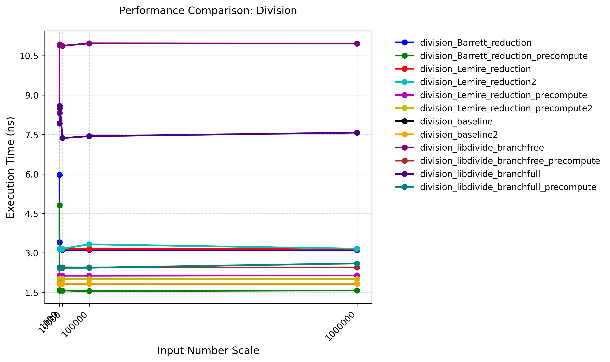

# Division Operation

## Performance Tests

### Testing Environment

+ CPU: Intel(R) Xeon(R) Platinum 8358 CPU @ 2.60GHz

+ OS: Rocky Linux 8.9 (Green Obsidian)

+ Compiler Version: G++ 10.5.0

+ Compilation Flags: -O3

+ Execution Command: `taskset -c 0 ./division ../config.json`

### Testing Result



Test result data is located at [division_result.json](./division_result.json).

## Assembly Code

For the complete assembly code, please check out [here](https://godbolt.org/z/q513rcdeY).

### Baseline

In fact, the two versions of the baseline source code result in the same assembly code. 

```asm
division_baseline(unsigned int, unsigned int):
        ; Input: a = edi (1st arg), b = esi (2nd arg)
        ; Output: quotient in eax, remainder in edx (packed into rax)

        mov     eax, edi      ; Load dividend (a) into eax (for div instruction)
        xor     edx, edx      ; Zero out edx (upper 32 bits of dividend, since it's 32-bit division)
        div     esi           ; Unsigned division: eax = eax / esi (quotient), edx = remainder
        sal     rdx, 32       ; Shift remainder (edx) left by 32 bits (to store in upper half of rax)
        or      rax, rdx      ; Combine quotient (eax) and shifted remainder (rdx) into rax
        ret                   ; Return (rax holds the packed DivResult)

division_baseline2(unsigned int, unsigned int):
        ; The same
```

### Barrett Reduction

As we can see, if we don't know "b" (the divisor) ahead of time, we cannot eliminate "div" instruction, and end up with more instructions in the assembly.

```asm
division_Barrett_reduction(unsigned int, unsigned int):
        ; Input: a (dividend) in edi, b (divisor) in esi
        ; Output: quotient in eax, remainder in edi (packed into xmm0)

        mov     ecx, esi      ; Move divisor (b) to ecx for division
        mov     rax, -1       ; Load 2^64 - 1 into rax (max uint64_t value)
        xor     edx, edx      ; Clear edx (upper bits for 64-bit division)
        div     rcx           ; Divide rax by rcx: rax = floor(2^64 / b), rdx = remainder
        
        ; Now rax contains m = floor(2^64 / b)
        mov     edx, edi      ; Move dividend (a) to edx
        mov     ecx, esi      ; Move divisor (b) to ecx again
        mul     rdx           ; Multiply m (in rax) by a (in rdx), result in rdx:rax
                              ; Since we only care about the high 64 bits (rdx), we ignore rax

        ; Compute quotient approximation (q = floor((a*m)/2^64))
        imul    ecx, edx      ; Compute q*b (quotient * divisor)
        mov     eax, edx      ; Move quotient to eax (return value)
        sub     edi, ecx      ; Compute remainder: r = a - q*b

        ; Adjustment step (if remainder >= b)
        cmp     esi, edi      ; Compare divisor (b) with remainder
        ja      .L6           ; If b > remainder (r < b), jump to .L6 (no adjustment)
        lea     eax, [rdx+1]  ; Else increment quotient (q += 1)
        sub     edi, esi      ; And adjust remainder (r -= b)
        
.L6:
        ; Pack quotient and remainder into xmm0 for return
        ; using general 64bits register or vector register is a choice for the compiler
        movd    xmm0, eax     ; Move quotient to xmm0[31:0]
        movd    xmm1, edi     ; Move remainder to xmm1[31:0]
        punpckldq xmm0, xmm1  ; Pack both 32-bit values into xmm0[63:0]
        movq    rax, xmm0     ; Move packed result to rax for return
        ret                   ; Return (rax contains {quotient, remainder})
```

### Lemire Reduction

```asm
division_Lemire_reduction(unsigned int, unsigned int):
        ; Input: a (dividend) in edi, b (divisor) in esi
        ; Output: quotient in r9d, remainder in edx (packed into xmm0)

        mov     ecx, esi      ; Move divisor (b) to ecx
        xor     edx, edx      ; Clear edx (upper bits for division)
        mov     rax, -1       ; Load 2^64 - 1 into rax
        mov     edi, edi      ; Zero-extend a to 64 bits (clears upper 32 bits of rdi)
        div     rcx           ; Compute m = floor(2^64 / b)
        
        ; Lemire computes m = ceil(2^64 / b) = floor(2^64 / b) + 1
        lea     rsi, [rax+1]  ; m = rax + 1 (Lemire's adjustment)
        
        ; Compute quotient = floor((a * m) / 2^64)
        mov     rax, rdi      ; Move dividend (a) to rax
        mul     rsi           ; Multiply a by m, result in rdx:rax
        mov     rax, rdi      ; Reload a (needed for remainder calculation)
        imul    rax, rsi      ; Compute a * m again (could be optimized out)
        mov     r9, rdx       ; Save quotient (high bits of product) in r9
        
        ; Compute remainder = floor((a * m * b) / 2^64)
        mul     rcx           ; Multiply previous result (a*m) by b, result in rdx:rax
                              ; We only need the high bits (rdx) which is the remainder
        
        ; Pack results for return
        movd    xmm0, r9d     ; Move quotient to xmm0[31:0]
        movd    xmm1, edx     ; Move remainder to xmm1[31:0]
        punpckldq xmm0, xmm1  ; Pack both values into xmm0[63:0]
        movq    rax, xmm0     ; Move packed result to rax for return
        ret                   ; Return (rax contains {quotient, remainder})
```

### Barrett Reduction (Precomputing Version)

If we know "b" (the divisor) ahead of time, then we can perform ahead-of-time "div" to compute "m". This eliminates the "div" instruction in the critical path and gives us some performance boost.

```asm
division_Lemire_reduction_precompute(unsigned int, unsigned int):
        ; Function prologue
        push    rbp              ; Save base pointer
        mov     ebp, esi         ; Store divisor (b) in ebp
        push    rbx              ; Save rbx (callee-saved register)
        mov     ebx, edi         ; Store dividend (a) in ebx
        sub     rsp, 8           ; Align stack

        ; Check if static variable 'm' is already initialized
        movzx   eax, BYTE PTR guard variable for division_Lemire_reduction_precompute(unsigned int, unsigned int)::m[rip]
        test    al, al           ; Test initialization flag
        je      .L16             ; Jump if not initialized

.L10:   ; Main execution path (after initialization)
        ; Load precomputed m = ceil(2^64 / b)
        mov     rsi, QWORD PTR division_Lemire_reduction_precompute(unsigned int, unsigned int)::m[rip]
        mov     edi, ebx         ; Reload dividend (a)
        add     rsp, 8           ; Restore stack

        ; Compute quotient = floor((a * m) / 2^64)
        mov     rax, rdi         ; Load a
        mul     rsi              ; Multiply a * m (result in rdx:rax)
        mov     rax, rdi         ; Reload a (for remainder calculation)
        imul    rax, rsi         ; Compute a * m again
        mov     rbx, rdx         ; Store quotient (high bits of first mul)

        ; Compute remainder = floor((a * m * b) / 2^64)
        mul     rbp              ; Multiply (a*m) by b (result in rdx:rax)

        ; Pack results into xmm0 for return
        movd    xmm0, ebx        ; Move quotient to xmm0[31:0]
        pop     rbx              ; Restore rbx
        pop     rbp              ; Restore rbp
        movd    xmm1, edx        ; Move remainder to xmm1[31:0]
        punpckldq xmm0, xmm1     ; Pack both 32-bit values into xmm0[63:0]
        movq    rax, xmm0        ; Move packed result to rax for return
        ret                      ; Return {quotient, remainder}

.L16:   ; Initialization path for static variable 'm'
        ; Thread-safe initialization using guard variable
        mov     edi, OFFSET FLAT:guard variable for division_Lemire_reduction_precompute(unsigned int, unsigned int)::m
        call    __cxa_guard_acquire  ; Acquire guard lock
        test    eax, eax             ; Check if initialization is needed
        je      .L10                 ; Jump if another thread did it

        ; Compute m = ceil(2^64 / b) = (2^64-1)/b + 1
        xor     edx, edx         ; Clear upper dividend bits
        mov     rax, -1          ; Load 2^64-1
        mov     edi, OFFSET FLAT:guard variable for division_Lemire_reduction_precompute(unsigned int, unsigned int)::m
        div     rbp              ; Divide (2^64-1) by b (result in rax)
        add     rax, 1           ; ceil(2^64 / b) = floor((2^64-1)/b) + 1
        mov     QWORD PTR division_Lemire_reduction_precompute(unsigned int, unsigned int)::m[rip], rax  ; Store m

        ; Release guard and finish initialization
        call    __cxa_guard_release
        jmp     .L10             ; Continue to main execution
```

### Lemire Reduction (Precomputing Version)

```asm
division_Barrett_reduction_precompute(unsigned int, unsigned long):
        ; Function prologue
        push    rbp              ; Save base pointer
        mov     rbp, rsi         ; Store divisor (b) in rbp
        push    rbx              ; Save rbx (callee-saved register)
        mov     ebx, edi         ; Store dividend (a) in ebx
        sub     rsp, 8           ; Align stack

        ; Check if static variable 'm' is initialized
        movzx   eax, BYTE PTR guard variable for division_Barrett_reduction_precompute(unsigned int, unsigned long)::m[rip]
        test    al, al           ; Test initialization flag
        je      .L45             ; Jump if not initialized

.L38:   ; Main execution path
        ; Compute q = floor((a * m) / 2^64)
        mov     eax, ebx         ; Load dividend (a)
        mul     QWORD PTR division_Barrett_reduction_precompute(unsigned int, unsigned long)::m[rip]  ; Multiply a * m
        mov     ecx, edx         ; Store quotient (high bits) in ecx

        ; Compute remainder r = a - q * b
        mov     eax, edx         ; Move quotient to eax
        imul    ecx, ebp         ; Compute q * b
        sub     ebx, ecx         ; r = a - q*b
        mov     ecx, ebx         ; Store remainder in ecx
        mov     rdi, rcx         ; Prepare remainder for comparison

        ; Adjustment: if r >= b, increment q and subtract b from r
        cmp     rcx, rbp         ; Compare r and b
        jb      .L40             ; Jump if r < b (no adjustment needed)
        lea     eax, [rdx+1]     ; q += 1
        sub     edi, ebp         ; r -= b

.L40:   ; Pack results for return
        movd    xmm0, eax        ; Move quotient to xmm0[31:0]
        movd    xmm1, edi        ; Move remainder to xmm1[31:0]
        add     rsp, 8           ; Restore stack
        punpckldq xmm0, xmm1     ; Pack both values into xmm0[63:0]
        pop     rbx              ; Restore rbx
        pop     rbp              ; Restore rbp
        movq    rax, xmm0        ; Move packed result to rax
        ret                      ; Return {quotient, remainder}

.L45:   ; Initialization path for static variable 'm'
        ; Thread-safe initialization
        mov     edi, OFFSET FLAT:guard variable for division_Barrett_reduction_precompute(unsigned int, unsigned long)::m
        call    __cxa_guard_acquire  ; Acquire guard lock
        test    eax, eax             ; Check if initialization is needed
        je      .L38                 ; Jump if another thread did it

        ; Compute m = floor(2^64 / b)
        xor     edx, edx         ; Clear upper dividend bits
        mov     rax, -1          ; Load 2^64-1
        mov     edi, OFFSET FLAT:guard variable for division_Barrett_reduction_precompute(unsigned int, unsigned long)::m
        div     rbp              ; Divide (2^64-1) by b (result in rax)
        mov     QWORD PTR division_Barrett_reduction_precompute(unsigned int, unsigned long)::m[rip], rax  ; Store m

        ; Release guard and finish initialization
        call    __cxa_guard_release
        jmp     .L38             ; Continue to main execution
```

### Why the precomputing version is faster

Take the Barrett Reduction (Precomputing Version) as example, we can also learn about the way g++ implements function static variable:

```asm
        ; Check if static variable 'm' is already initialized
        movzx   eax, BYTE PTR guard variable for division_Lemire_reduction_precompute(unsigned int, unsigned int)::m[rip]
        test    al, al           ; Test initialization flag
        je      .L16             ; Jump if not initialized

.L10:   ; Main execution path (after initialization)
        ; Load precomputed m = ceil(2^64 / b)
        mov     rsi, QWORD PTR division_Lemire_reduction_precompute(unsigned int, unsigned int)::m[rip]
        mov     edi, ebx         ; Reload dividend (a)
        add     rsp, 8           ; Restore stack
```

The compiler maintains guard variable for each function static variable to indicate intialization state. And before touching the static variable, we look into the guard variable to see if the static variable has been initialized. If so, we can load it from the address table. 

```asm
.L16:   ; Initialization path for static variable 'm'
        ; Thread-safe initialization using guard variable
        mov     edi, OFFSET FLAT:guard variable for division_Lemire_reduction_precompute(unsigned int, unsigned int)::m
        call    __cxa_guard_acquire  ; Acquire guard lock
        test    eax, eax             ; Check if initialization is needed
        je      .L10                 ; Jump if another thread did it

        ; Compute m = ceil(2^64 / b) = (2^64-1)/b + 1
        xor     edx, edx         ; Clear upper dividend bits
        mov     rax, -1          ; Load 2^64-1
        mov     edi, OFFSET FLAT:guard variable for division_Lemire_reduction_precompute(unsigned int, unsigned int)::m
        div     rbp              ; Divide (2^64-1) by b (result in rax)
        add     rax, 1           ; ceil(2^64 / b) = floor((2^64-1)/b) + 1
        mov     QWORD PTR division_Lemire_reduction_precompute(unsigned int, unsigned int)::m[rip], rax  ; Store m

        ; Release guard and finish initialization
        call    __cxa_guard_release
        jmp     .L10             ; Continue to main execution
```

And if the static variable has not been initialized, we jump here. And we call "__cxa_guard_acquire" / "__cxa_guard_release" function pair to ensure thread safety. Then we compute the value of the static variable.

Therefore, the "div" instruction is only executed once and not executed in the critical path. In this way we can achieve better performance than naive integer division.

## References

1. [en.algorithmica.org:division](https://en.algorithmica.org/hpc/arithmetic/division/)