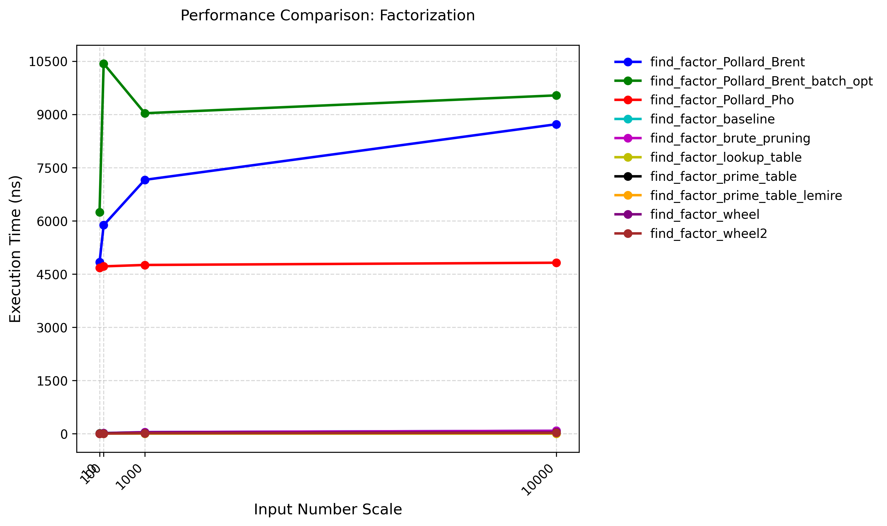

# Integer Factorization algorithm

## Performance Tests

### Testing Environment

+ CPU: Intel(R) Xeon(R) Platinum 8358 CPU @ 2.60GHz

+ OS: Rocky Linux 8.9 (Green Obsidian)

+ Compiler Version: G++ 10.5.0

+ Compilation Flags: -O3

+ Execution Command: `taskset -c 0 ./factorization ../config.json`

Use the product of two prime numbers to test the functions.

### Testing Result

Test result data is located at [factorization_result.json](./factorization_result.json).

## References

1. [en.algorithmica.org:factorization](https://en.algorithmica.org/hpc/algorithms/factorization/)