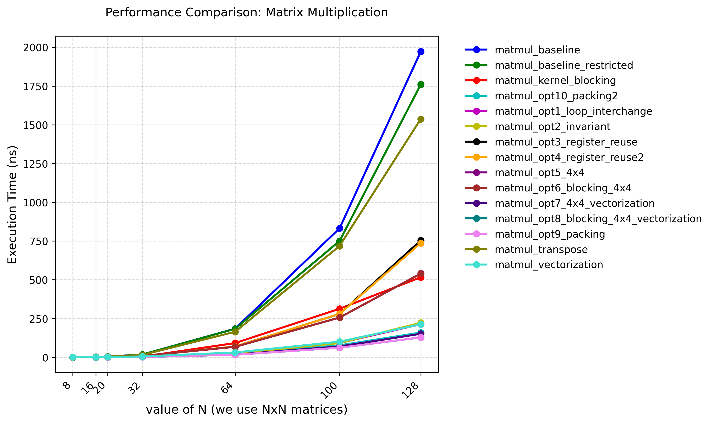
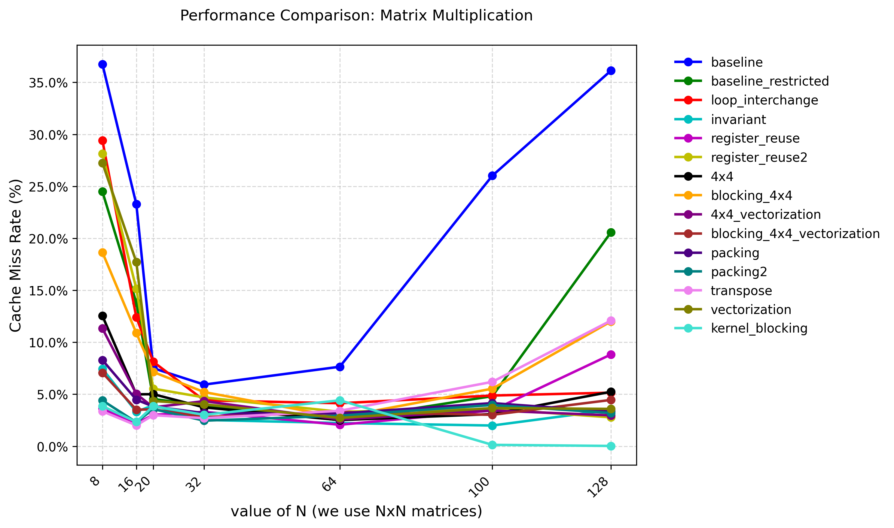
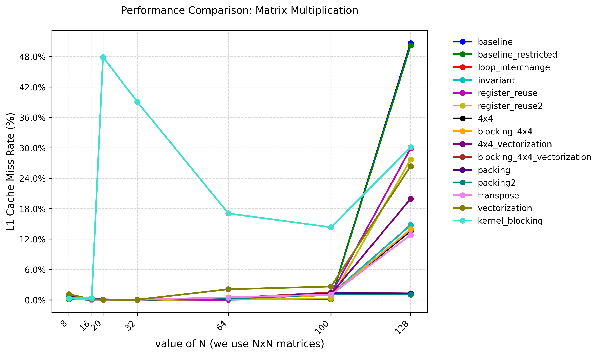
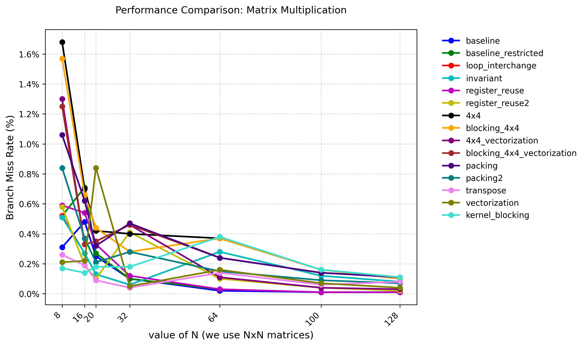

# Matrix Multiplication Algorithm (Row Major)

## Optimizations

1. **Baseline Implementation**
   - Naive 3-layer loop implementation

2. **Loop Interchange**
   - Swaps the order of loops to improve cache locality
   - Better memory access pattern by accessing elements sequentially
   - Reduces cache misses

3. **Loop Invariant Code Motion**
   - Moves invariant calculations outside inner loops
   - Reduces redundant calculations

4. **Register Reuse**
   - Unrolls inner loops and uses registers for intermediate results
   - Processes 4 elements at a time
   - Reduces memory accesses and improves cache utilization

5. **4x4 Blocking**
   - Divides matrix into 4x4 blocks
   - Improves cache utilization by working on smaller blocks

6. **Larger Block Sizes (256x128)**
   - Uses larger block sizes tuned for cache hierarchy
   - Better utilization of L2/L3 cache
   - Balances between cache efficiency and overhead

7. **SIMD Vectorization (SSE/AVX)**
   - Uses SIMD instructions for parallel processing
   - Processes 4 elements simultaneously using __m128 registers
   - Combines blocking with vectorized operations

8. **Packed Data Layout**
   - Packs matrix A into contiguous memory format
   - Improves memory access patterns
   - Better utilization of cache lines

9. **Double Packing**
    - Packs both matrices A and B into contiguous format
    - Uses aligned memory for both packed matrices
    - Maximum memory access optimization

## Performance Test

### Test Environment

+ CPU: Intel(R) Xeon(R) Platinum 8358 CPU @ 2.60GHz

+ OS: Rocky Linux 8.9 (Green Obsidian)

+ Compiler Version: G++ 10.5.0

+ Compilation Flags: -O3

+ Execution Command: `taskset -c 0 ./matmul ../config.json`

### Test Results

Test result data is located at [matmul_result.json](./matmul_result.json).

### Profiling Results

#### Cache miss rate

Test result data is located at [profile_result_cache_miss_rate.json](./profile_result_cache_miss_rate.json).

#### L1 DCache load miss rate

Test result data is located at [profile_result_L1_cache_miss_rate.json](./profile_result_L1_cache_miss_rate.json).

#### Branch miss rate

Test result data is located at [profile_result_branch_miss.json](./profile_result_branch_miss.json).

## Performance Analysis

### Overall Performance Trends

1. **Baseline vs Optimized Versions**
   - Baseline implementation shows highest execution time (1972.8ms for N=128)
   - Most optimized version (packing) achieves ~12x speedup (128.1ms for N=128)
   - Cache miss rate correlates strongly with performance:
     - Baseline: 36.1% cache miss rate
     - Packing: 3.3% cache miss rate

2. **Cache Optimization Impact**
   - Blocking strategies significantly reduce cache misses:
     - 4x4 blocking: ~5.2% cache miss rate
     - Blocking with vectorization: ~4.5% cache miss rate
     - Double packing: ~3.2% cache miss rate
   - L1 cache miss rates show similar trends:
     - Baseline: up to 50.7% L1 miss rate
     - Optimized versions: typically < 2% L1 miss rate

3. **Branch Prediction Impact**
   - Branch miss rates are generally low (< 2%) for all implementations
   - More complex implementations (4x4, blocking) show slightly higher branch miss rates
   - Branch misses have less impact on performance compared to cache misses

### Implementation-Specific Analysis

1. **Loop Transformations**
   - Loop interchange and invariant code motion:
     - ~9x speedup over baseline
     - Cache miss rate reduced from 36.1% to ~5.2%
     - Branch miss rate remains low (< 0.3%)

2. **Register Reuse**
   - Register reuse implementations:
     - ~2.6x speedup over baseline
     - Cache miss rate: ~8.8%
     - Shows importance of register-level optimization

3. **Blocking Strategies**
   - 4x4 blocking:
     - ~3.6x speedup over baseline
     - Cache miss rate: ~5.2%
     - Higher branch miss rate (up to 1.7%)
   - Larger blocks (256x128):
     - Similar performance to 4x4
     - Better for larger matrices

4. **Vectorization**
   - SIMD vectorization:
     - ~9.3x speedup over baseline
     - Cache miss rate: ~3.6%
     - Low branch miss rate (< 0.8%)

5. **Packing Optimizations**
   - Single packing:
     - ~15.4x speedup over baseline
     - Cache miss rate: ~3.3%
     - Best overall performance
   - Double packing:
     - ~12.4x speedup over baseline
     - Lowest cache miss rate: ~3.2%

## References

1. [en.algorithmica.org:matrix multiplication](https://en.algorithmica.org/hpc/algorithms/matmul/)

2. [how-to-optimize-gemm](https://github.com/flame/how-to-optimize-gemm/wiki)

3. [Optimizing-DGEMM-on-Intel-CPUs-with-AVX512F](https://github.com/yzhaiustc/Optimizing-DGEMM-on-Intel-CPUs-with-AVX512F)

4. [matmul-cache-blocking-demo](https://jukkasuomela.fi/cache-blocking-demo/)