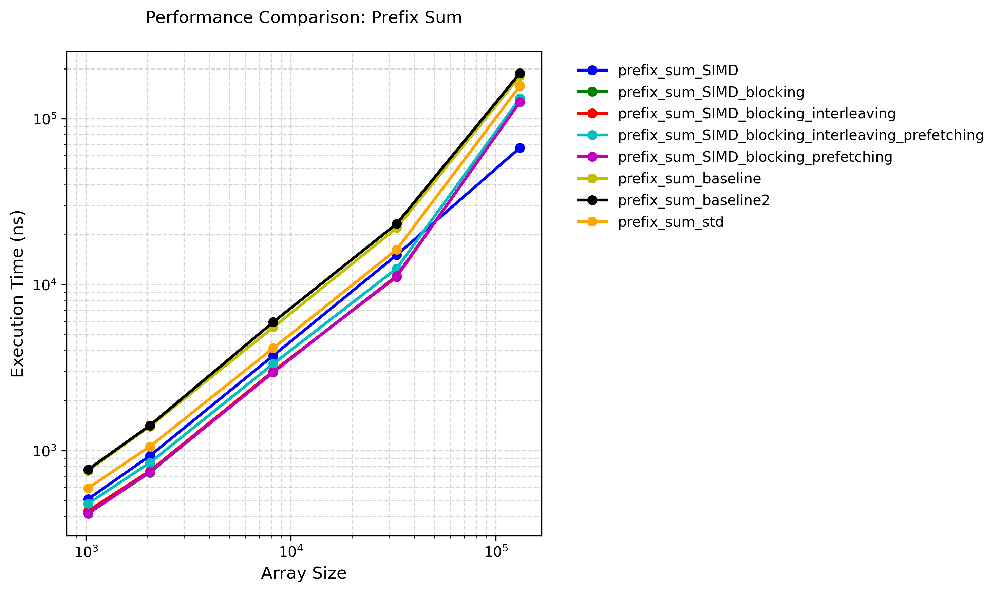

# Prefix Sum Algorithm

## Optimizations

1. Naive baseline and standard library implementation both performed badly.

2. We can make use of SIMD instructions to do batch processing. We can compute the local prefix sum value of each 4 int32 elements, followed by a accumulation stage to adjust each prefix sum value (Add a base value).

We can compute the local prefix sum values of a 8-elements group using avx256, and do accumulation of a 4-elements group using avx128. (There's some reason for the SIMD width we chose, dealing with the 128-bit lane size of avx256)

3. The problem for SIMD version is that we have to scan through the whole array twice. And if the array size is larger than the L1 cache, we will have many cache misses in the second scan.

Therefore we can do block processing to mitigate that. We can assign a block size that is close to the size of the L1 cache, and calculate the local prefix sum, then do accumulation in a row for each block. Therefore the cache hit rate is larger.

4. And the problem with block processing is that, the hardware prefetcher may be confused about our memory accessing pattern (however AFAIK, the pattern occured here is easy for the hardware prefetcher to comprehend). And if that's the case, we can use some sort of software prefetching using compiler hints like "__builtin_prefetch" in gcc.

5. Finally, it can be observed that, for smaller block sizes, the pipeline tend to stall, and for larger block sizes, the cache miss rate is potentially higher. And maybe we can mix different block sizes together to get the befinits of both worlds.

## Performance Test

### Test Environment

+ CPU: Intel(R) Xeon(R) Platinum 8358 CPU @ 2.60GHz

+ OS: Rocky Linux 8.9 (Green Obsidian)

+ Compiler Version: G++ 10.5.0

+ Compilation Flags: -O3

+ Execution Command: `taskset -c 0 ./prefix_sum ../config.json`

### Test Results

Test result data is located at [prefix_sum_result.json](./prefix_sum_result.json).

## References

1. [en.algorithmica.org:prefix](https://en.algorithmica.org/hpc/algorithms/prefix/)